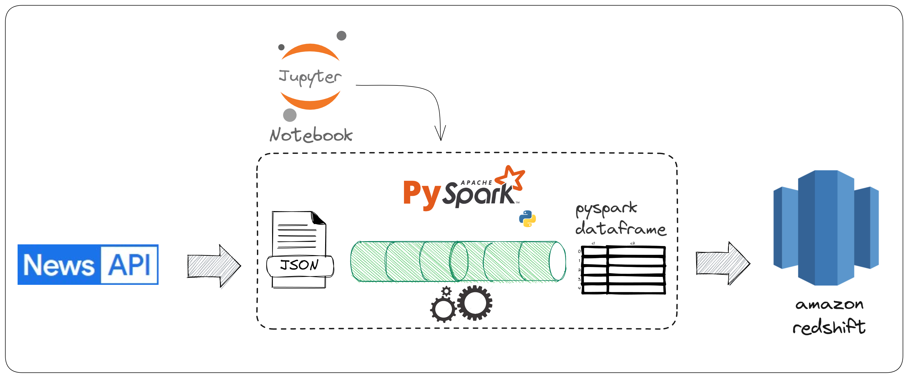
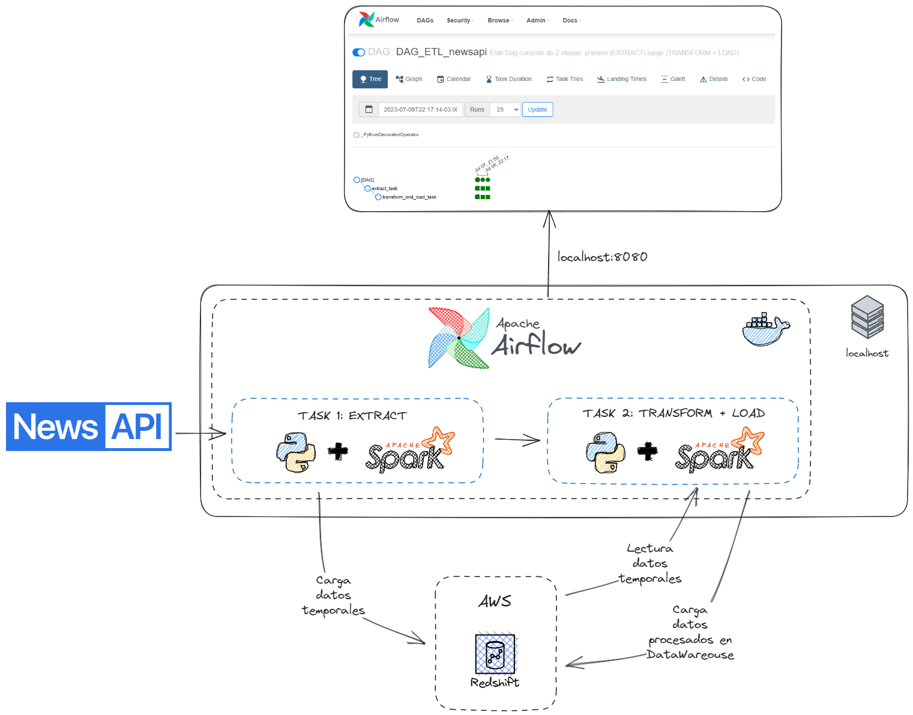

## Autor: Illak Zapata
---
# TP1 - Coderhouse - DE-FLEX 🚀

Se recomienda acceder a la versión de colab ya que explica el paso a paso del proyecto:

==============<br>
👉 [ENLACE A COLAB](https://colab.research.google.com/drive/1pVPXV6G2QoeSIrqzPC1qktQLt9797npE?usp=sharing) <br>
==============<br>

mientras que el archivo *TP1_local.ipynb* contiene el código necesario y adaptado para correr el proyecto de manera local.

Notar que para la versión local se requieren las siguientes variables de entorno (en un archivo `.env`):

```
NEWSAPI_KEY=XXXXXXXXXXXXXXXXXXXXXXXXXXXXX
REDSHIFT_HOST=XXXXXXXXXXXXXXXXXXXXXXXXXXXXX
REDSHIFT_POST=XXXX
REDSHIFT_USER=XXXXXXXXXXXXXXXXXXXXXXXXXXXXX
REDSHIFT_PASS=XXXXXXXXXXXXXXXXXXXXXXXXXXXXX
REDSHIFT_DATABASE=XXXXXXXXXXXXXXXXXXXXXXXXXXXXX
```

La tabla creada en redshift se llama `df_news_api_dw` y se usó el siguiente script para su construcción:

```sql
delete from i_zapata1989_coderhouse.df_news_api_dw;


CREATE TABLE i_zapata1989_coderhouse.df_news_api_dw (
	idrecord bigint identity(1,1),
	author varchar(256),
	content varchar(1000),
	description varchar(1000),
	publishedat timestamp,
	title varchar(1000),
	url varchar(1000),
	urltoimage varchar(1000),
	source_name varchar(256),
	source_id varchar(256),
	primary key(idRecord)
) distkey(source_name) sortkey(publishedat);
```

## Descripción breve del proyecto
Se eligió la api [NewsAPI](https://newsapi.org/), la cual nos permite obtener miles de artículos de miles de fuentes sobre un tema en particular y en un periodo de tiempo específico.
La API cuenta con una versión gratuita que resulta suficiente para lograr el objetivo del entregable. Me pareció una opción interesante ya que los datos contienen una columna temporal que
permitiría hacer análisis en un periodo determinado de tiempo. Por otra parte contiene mucho dato *"textual"*, lo cual habilita a proyectos de *"text mining"*, en este caso, de **noticias**.

Algunas consideraciones:

- Se separó el proceso de **extracción** del de **carga** de datos, esto es:
  - la creación de la tabla para DW se hizo usando *DBeaver*
  - mientras que el proceso de obtención de datos desde la API y su posterior carga se realizó con Python (librerias `requests` + `pyspark`, entre otras)




---

# TP2 - Coderhouse - DE-FLEX 🚀

Para esta segunda entrega se pide que luego de la extracción de datos desde la API realizada en la anterior entrega, estos datos deben tener un "tratamiento" o **limpieza** y posteriormente
cargarlos en Redshift. Para esto se utilizó PySpark con el objetivo de que el procesamiento pueda escalar si los datos que se traen desde la API aumentan en términos de **volumen**.

Se recomienda acceder a la versión de colab ya que explica el paso a paso del proyecto:

==============<br>
👉 [ENLACE A COLAB](https://colab.research.google.com/drive/1pVPXV6G2QoeSIrqzPC1qktQLt9797npE#scrollTo=o4ceD9aeuY6w) <br>
==============<br>


---
# TP3 - Coderhouse - DE-FLEX 🚀
Para esta tercer entrega se debe **portar** las dos etapas anteriores a [Apache Airflow](https://airflow.apache.org/). Para esto se va a utilizar Docker, es decir, vamos a hacer el proyecto "portable", de esta manera podrá ejecutarse desde casi cualquier sistema y sin tanto trabajo. Como requisito se requiere tener instalado **Docker** y **Docker Compose**.

El proyecto se encuentra en la carpeta *[entregable_3_airflow](https://github.com/illak/TP_DE_FLEX_CODER/tree/master/entregable_3_airflow)*.

El directorio dag tiene la siguiente estructura:

```
.
├── .airflowignore
├── ETL_news_dag.py
├── __init__.py
└── pyscripts
    ├── .env
    ├── ETL_newsapi.py
    └── jars
        └── postgresql-42.2.27.jre7.jar
```

En donde:

* `ETL_news_dag.py` contiene el DAG que *orquesta* todo el proceso de *Extract + Transform + Load* de los datos.
* `ETL_newsapi.py` en el directorio `pyscripts` contiene código que básicamente realiza las tareas de los entregables 1 y 2. Este archivo no es registrado como DAG por el "scheduler" de airflow ya que se encuentra en el archivo `.airflowignore`.
* Es necesario completar el archivo `.env` con las credenciales necesarias. Para esto se debe seguir el modelo del archivo `.env_modelo` que se encuentra en en directorio de `pyscripts`.

A continuación se muestra el diagrama del flujo de datos y las tareas que orquesta Airflow:




## Para hacer el deploy:

Dentro del directorio del entregable 3:

```
$docker compose up --build
```

---
# TP4 - Final - Coderhouse - DE-FLEX 🚀

Para la entrega final se pide que, en base a lo realizado en la entrega anterior, se agreguen **alertas**. Estas alertas deberán enviarse mediante **mail**.

Para nuestro proyecto se planteó el envío de alertas en 3 situaciones:

- Ejecución exitosa: Para este caso se envía un mail cada vez que una tarea se realiza de manera correcta.
- Ejecución fallida (`email_on_failure`): Para este caso se envía un mail cada vez que una tarea falla en su ejecución.
- Reintento de ejecución (`email_on_retry`): Para este caso se envía un mail cada vez que se reintenta la ejecución de una tarea.

Es necesario configurar las variables de entorno en el archivo `env_keys.env` de la forma en que se muestra en el modelo de archivo `env_keys.env_modelo`:

```
AIRFLOW__SMTP__SMTP_MAIL_FROM='xxxxxxxx@gmail.com'
AIRFLOW__SMTP__SMTP_USER='xxxxxxxx@gmail.com'
AIRFLOW__SMTP__SMTP_PASSWORD='xxxxxxxxxxxxxxxxxx'
AIRFLOW__SMTP__SMTP_HOST='smtp.gmail.com'
AIRFLOW__SMTP__SMTP_PORT='587'
```

Para el caso anterior se hace uso del smtp de gmail. Además debemos configurar las variables de entorno como se explicó en la entrega anterior.


El proyecto se encuentra en la carpeta *[EntregaFinal_IllakZapata_DATENG_51935](https://github.com/illak/TP_DE_FLEX_CODER/tree/master/EntregaFinal_IllakZapata_DATENG_51935)*. Dentro del directorio levantamos el servicio con el comando:

```
$docker compose up --build
```